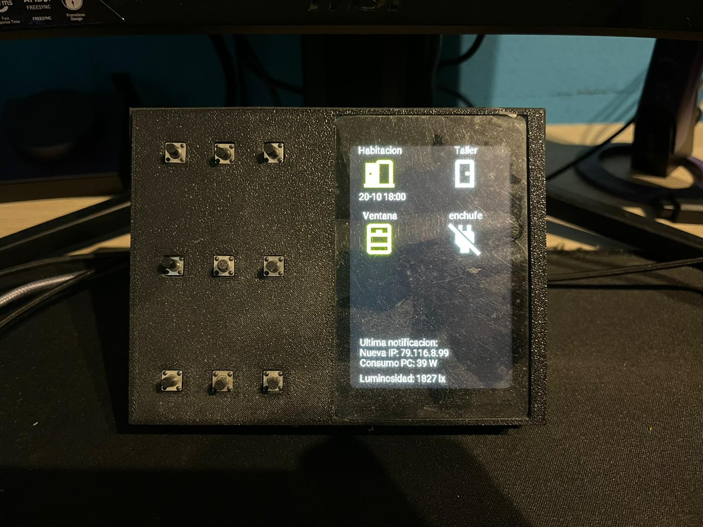
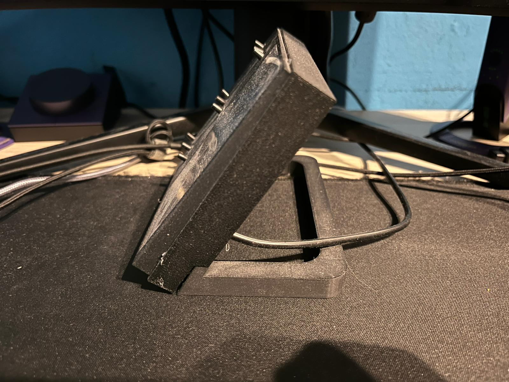
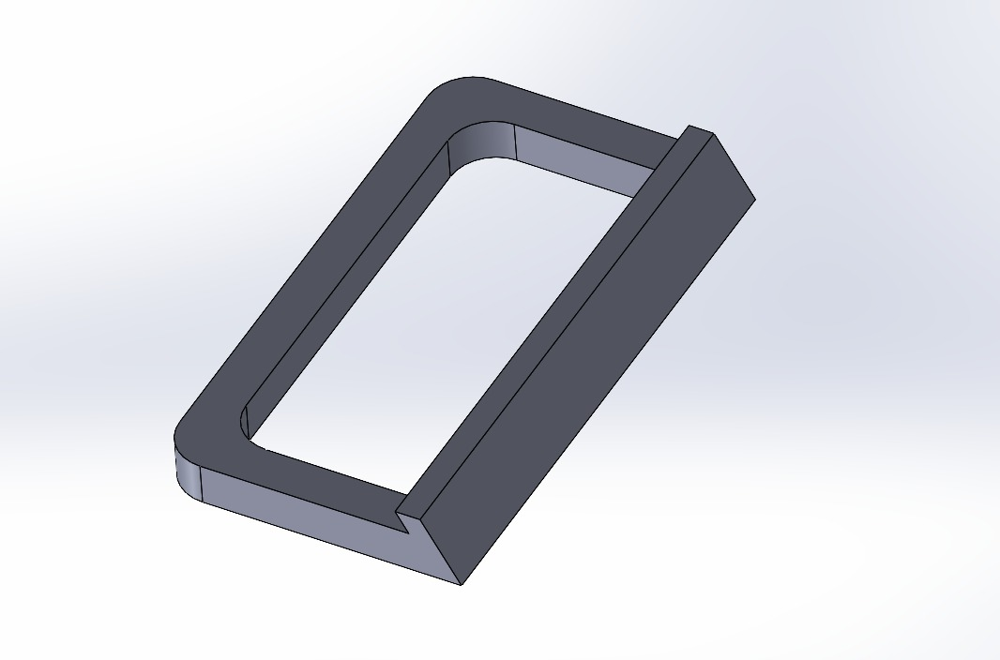
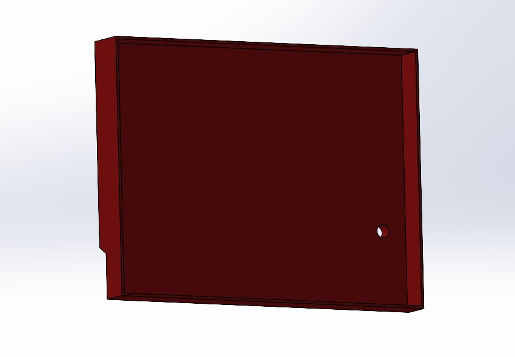
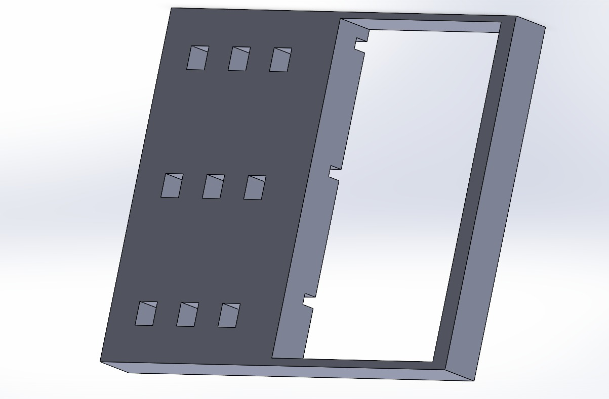

 # WallPanel for Home Assistant

WallPanel is a touchscreen control interface based on ESPHome, designed to integrate seamlessly with Home Assistant.
It provides a fully interactive display with 9 configurable buttons, real-time sensor visualization, and automatic backlight dimming

## Main Features

- **9 fully configurable buttons**
> Each button can be linked to any Home Assistant automation or entity — lights, scenes, sockets, blinds, etc.

- **Touch LCD display with adjustable backlight**

> Automatically dims to 30% brightness after 30 seconds of inactivity.
> Displays real-time system status and entity information.

- **Graphical sensor visualization**
> Shows the state of doors and windows, as well as smart plug status and other configured entities.

- **Full ESPHome + Home Assistant integration**
> Communicates natively without complex setup or extra software.

- **3D printable design**
> All STL files for the enclosure and mounting structure are included in the repository.

## Example: Home Assistant Automation
```yaml
automation:
  - alias: Turn on Living Room from WallPanel
    trigger:
      - platform: state
        entity_id: binary_sensor.wallpanel_button_1
        to: "on"
    action:
      - service: light.toggle
        target:
          entity_id: light.living_room
```

## Future Improvements
- Ambient light–based auto brightness 

- Backlight buttons (retroiluminated buttons)

- On-screen notification system

## Required Materials

- 9 buttons

- 9 330Ω resistors 

- 1 WT32-SC01 board


## Gallery
 <br>
  

